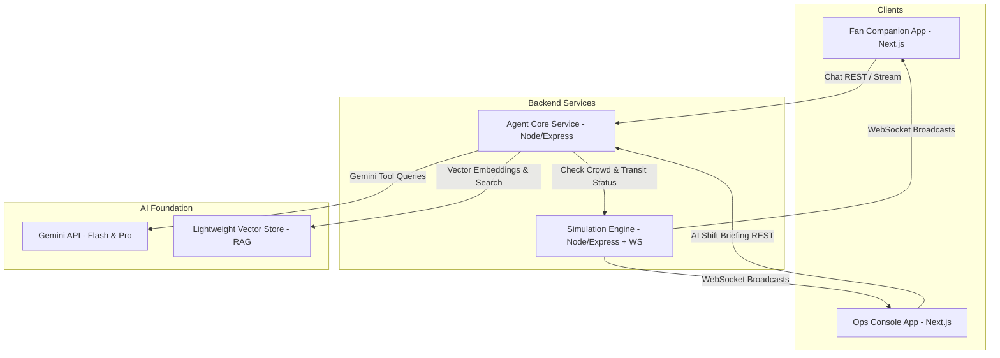

# StadiumPulse AI: Architecture

StadiumPulse AI is a platform designed for stadium operations and fan experience during the FIFA World Cup 2026. It features a distributed architecture connected by real-time updates and a Gemini-powered Agent Core.

## System Overview

## Component Details

### 1. Fan Companion Mobile Web App

- A mobile-first responsive UI built using Next.js, Tailwind CSS, and custom styling.
- Features real-time multilingual chat assistance with Speech-to-Text (STT) and Text-to-Speech (TTS).
- Displays a custom interactive SVG venue map showing accessible vs standard pathfinding routes based on live crowd data.

### 2. Ops Command Center

- Live dashboard displaying:
  - Crowd heatmap (zone-by-zone occupancy and density status).
  - Incident logs (active alerts, server metrics, simulated triggers).
  - AI Situational Briefing generator that displays automatically compiled summaries of the operational state.
  - Real-time Gemini Agent Trace reasoning panel.

### 3. Agent Core

- The GenAI brain of StadiumPulse.
- Integrates with Gemini API with function calling to dynamically execute search, pathfinding, and situational reports.
- Employs a local semantic Vector Store loaded with match day FAQs, accessibility rules, transit maps, and stadium guidelines for grounded RAG query responses.

### 4. Simulation Engine

- Tracks and pushes telemetry for:
  - Zone counts (Gates A-D, Concourse levels, seating sections).
  - Transit routes status (Metro, Shuttles, Parking Lots).
  - Incidents (e.g. wet floor in Zone B, fire alert near Gate C).
- Exposes controls to dynamically mock spikes and incident updates for demonstration purposes.
